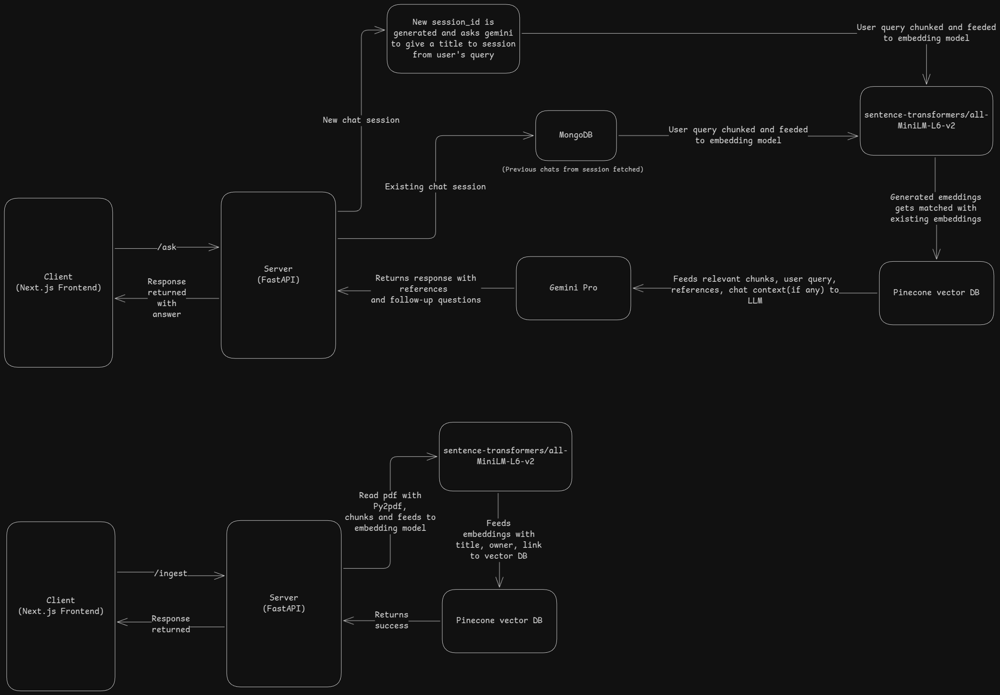

# 🚀 Full-Stack App Setup Guide

This guide will help you set up the frontend and backend using **Docker Compose** on Linux, macOS, or Windows.

---

## 🛠 Prerequisites

### Install Docker and Docker Compose

#### **Linux (Ubuntu/Debian-based)**

```sh
# Install Docker
sudo apt update
sudo apt install docker.io -y

# Install Docker Compose (latest version)
sudo curl -L "https://github.com/docker/compose/releases/latest/download/docker-compose-$(uname -s)-$(uname -m)" -o /usr/local/bin/docker-compose
sudo chmod +x /usr/local/bin/docker-compose

# Verify Installation
docker --version
docker-compose --version
```

#### **macOS**

1. Install **Docker Desktop**: [Download here](https://www.docker.com/products/docker-desktop/)
2. After installation, open **Docker Desktop** and ensure it's running.
3. Verify installation with:
   ```sh
   docker --version
   docker-compose --version
   ```

#### **Windows**

1. Install **Docker Desktop** from [here](https://www.docker.com/products/docker-desktop/).
2. Enable **WSL 2** (Windows Subsystem for Linux) during installation.
3. Restart your computer and ensure **Docker Desktop** is running.
4. Open **PowerShell** and verify the installation:
   ```sh
   docker --version
   docker-compose --version
   ```

---

## 🚀 Setting Up the Project

### **1️⃣ Clone the Repository**

```sh
git clone https://github.com/shoaib-31/MedMitra-RAG-QA.git
cd MedMitra-RAG-QA/deployment
```

### **2️⃣ Set Environment Variables in Docker Compose**

Instead of using an `.env` file, define your environment variables directly in `docker-compose.yml`. Modify the `environment` section for each service like this:

```yaml
services:
  backend:
    environment:
      - PINECONE_API_KEY=your_pinecone_key
      - GEMINI_API_KEY=your_gemini_key
      - PINECONE_INDEX_NAME=docs
```

### **3️⃣ Run Docker Compose**

```sh
cd deployment
docker-compose up --build
```

- This will build the **frontend**, **backend**, and **MongoDB** containers.
- Wait until the logs indicate that all services are running.

### **4️⃣ Open the App**

Once the setup is complete:

- Open your browser and go to: [http://localhost:3000](http://localhost:3000)
- Backend API (if needed for testing): [http://localhost:8000](http://localhost:8000)

### **5️⃣ Stopping the Services**

To stop the containers:

```sh
docker-compose down
```

### **6️⃣ Restarting the Services**

If you make changes and need to restart:

```sh
cd deployment
docker-compose up --build
```

## Here, please wait "Application startup complete." appears in logs.

## 📂 Project Architecture

Here is the folder structure of this repository:



## 🔥 Common Issues & Fixes

### 🛑 **Docker: Permission Denied on Linux?**

```sh
sudo usermod -aG docker $USER
newgrp docker
```

Then restart your terminal.

### 🛑 **MongoDB Data Persistence**

MongoDB stores data in a volume (`mongo_data`). If you want to **clear all stored data**, run:

```sh
docker volume rm mongo_data
```

### 🛑 **Port Already in Use?**

If port **3000** (frontend) or **8000** (backend) is in use, modify the `ports:` section in `docker-compose.yml`:

```yaml
frontend:
  ports:
    - "8080:3000" # Access frontend at localhost:8080
backend:
  ports:
    - "9000:8000" # Access backend at localhost:9000
```

Futher change `NEXT_PUBLIC_SERVER_URL` in ARGS of frontend also if backend port ever changes.

Then restart Docker Compose:

```sh
cd deployment
docker-compose up --build
```

---
